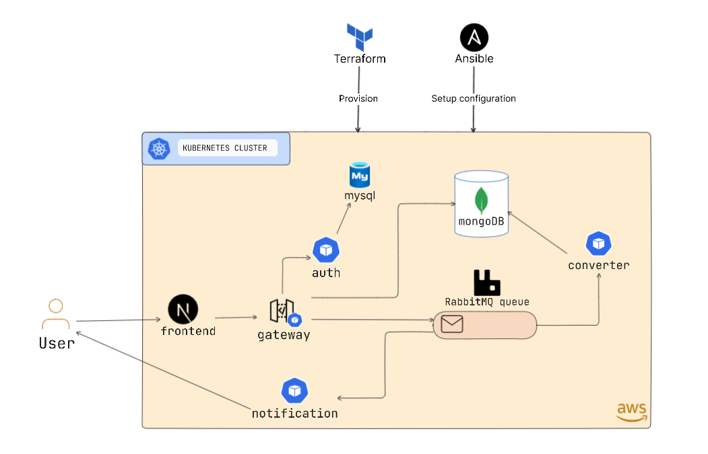

# Microservices Mp3 Converter

volumes: The ./mysql:/docker-entrypoint-initdb.d line mounts the mysql directory from your host
 (which contains your init.sql) to the container's /docker-entrypoint-initdb.d directory. MySQL
 will execute any .sql, .sh, or .sql.gz files found in this directory in alphabetical order.

---

If you run the server you will notice that the server is only accessible from your own
computer, not from any other in the network. This is the default because in debugging
mode a user of the application can execute arbitrary Python code on your computer.

If you have the debugger disabled or trust the users on your network, you can make the
server publicly available simply by adding --host=0.0.0.0 to the command line:
$ flask run 0.0.0.0 This tells your operating system to listen on all public IPs.
