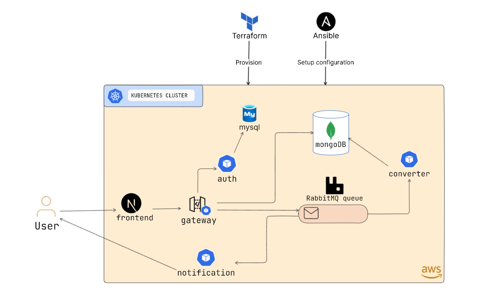

# Microservices Mp3 Converter

## Architecture

The project consists of 8 services in total:

> Click on the links to see the detailed documentation about the implementation of the services

1. [Frontend](./src/frontend/) - Acts as the entry point for the user. It is a simple web application with very intuitive UI. It is built using NextJS.
2. [Gateway](./src/gateway/) - It is a flask server which is at the center of the architecture. It recieves requests from the frontend and is responsible for routing the requests to the appropriate service.
3. [Auth](./src/auth/) - It is again a flask server which handles all of the authentication related tasks. It is reached out by gateway. It uses JWT for authentication.
4. [MySQL](./kubernetes/manifests/mysql/) - It is not a service but a database which is used by the auth service to store user data.
5. [MongoDB](./kubernetes/manifests/mongodb/) - It is the primary database for storing the files (mp4 and mp3). It is contacted by the gateway service and converter service
6. [RabbitMQ](./kubernetes/manifests/rabbit/) - It is used for queueing the conversion tasks. After the file is uploaded, the gateway service sends a message to the rabbitmq and the converter service consumes those messages
7. [Converter](./src/converter/) - It is the core service of the architecture. It is responsible for converting the mp4 file to mp3. Upon getting messages from the rabbitmq queue, it grabs the file from the mongodb and converts it to mp3 and puts it back to mongodb, and puts the message in rabbitmq that the file has been converted. That message is consumed by the next service that is...
8. [Notification](./src/notification/) - It is not a server but a python script which continuously listens to the rabbitmq for the messages that the file has been converted. After receiving the message it sends an email to the user with the file ID.

## Working

> The working mentioned below is the flow by which the user interacts with the system

1. **Registration and Login**: Users must first register and log in using their email and password. Upon successful login, as JWT  token will be issued, which will handle authentication
2. **File Upload**: After logging in, users can upload and MP4 file for conversion.
3. Once the file is uploaded, the file will be converted to MP3 and the user will be notified via email along with the file ID.
4. **File Download**: Users can use the received file ID to download the converted MP3 file.

## Project Structure

## Misc

volumes: The ./mysql:/docker-entrypoint-initdb.d line mounts the mysql directory from your host
 (which contains your init.sql) to the container's /docker-entrypoint-initdb.d directory. MySQL
 will execute any .sql, .sh, or .sql.gz files found in this directory in alphabetical order.

---

If you run the server you will notice that the server is only accessible from your own
computer, not from any other in the network. This is the default because in debugging
mode a user of the application can execute arbitrary Python code on your computer.

If you have the debugger disabled or trust the users on your network, you can make the
server publicly available simply by adding --host=0.0.0.0 to the command line:
$ flask run 0.0.0.0 This tells your operating system to listen on all public IPs.
