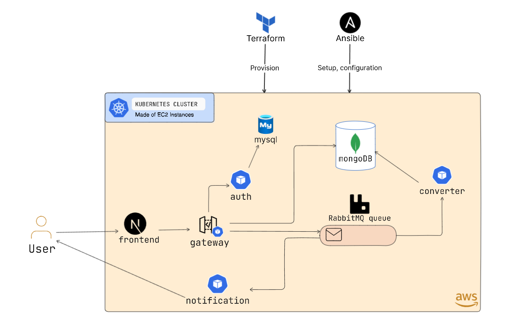

# Microservices Mp3 Converter



## Demo(s)

Deployment demo on AWS video goes here (making it soon)

Demo usage video goes here (making it soon)

## Architecture

The project consists of 8 services in total:

> Click on the links to see the detailed documentation about the implementation of the services

1. [Frontend](./src/frontend/) - Acts as the entry point for the user. It is a simple web application with very intuitive UI. It is built using NextJS.
2. [Gateway](./src/gateway/) - It is a flask server which is at the center of the architecture. It recieves requests from the frontend and is responsible for routing the requests to the appropriate service.
3. [Auth](./src/auth/) - It is again a flask server which handles all of the authentication related tasks. It is reached out by gateway. It uses JWT for authentication.
4. [MySQL](./kubernetes/manifests/mysql/) - It is not a service but a database which is used by the auth service to store user data.
5. [MongoDB](./kubernetes/manifests/mongodb/) - It is the primary database for storing the files (mp4 and mp3). It is contacted by the gateway service and converter service
6. [RabbitMQ](./kubernetes/manifests/rabbit/) - It is used for queueing the conversion tasks. After the file is uploaded, the gateway service sends a message to the rabbitmq and the converter service consumes those messages
7. [Converter](./src/converter/) - It is the core service of the architecture. It is responsible for converting the mp4 file to mp3. Upon getting messages from the rabbitmq queue, it grabs the file from the mongodb and converts it to mp3 and puts it back to mongodb, and puts the message in rabbitmq that the file has been converted. That message is consumed by the next service that is...
8. [Notification](./src/notification/) - It is not a server but a python script which continuously listens to the rabbitmq for the messages that the file has been converted. After receiving the message it sends an email to the user with the file ID.

## Working

> The working mentioned below is the flow by which the user interacts with the system

1. **Registration and Login**: Users must first register and log in using their email and password. Upon successful login, as JWT  token will be issued, which will handle authentication
2. **File Upload**: After logging in, users can upload and MP4 file for conversion.
3. Once the file is uploaded, the file will be converted to MP3 and the user will be notified via email along with the file ID.
4. **File Download**: Users can use the received file ID to download the converted MP3 file.

## Project Structure

- `.github/` - Contains github actions files for build and push of docker images
- `kind/` - It contains configurations for creating local kubernetes cluster using kind. There are 2 files `kind-cluster.yaml` and `kind-ingress.yaml`. The first file is used to create the cluster and the second file is used to create the ingress controller.
- `kubernetes/` - Contains the kubernetes manifests for the services
- `playbooks/` - Contains the ansible playbooks for setting up the kubernetes cluster and deploying the services
- `public/` - Contains the images used in the README
- `src/` - Contains the source code for the services
- `terraform/` - Contains the terraform files for setting up the infrastructure on AWS
- `deploy.ps1` - Powershell script for deploying the services on the kubernetes cluster. It contains 2 commands needed to provision (using terraform) the infrastructure and cluster setup with deployment the services (using ansible).
- `hosts.ini` - It is a template file populated by the terraform for acting as the inventory file for ansible. It contains the IP addresses of the instances created by terraform.

## Setup

### Prerequisites

- [Kubeseal](https://github.com/bitnami-labs/sealed-secrets) - Needed to encrypt the secrets in the kubernetes manifests

**Local Deployment:**

- [Docker](https://docs.docker.com/get-docker/)
- [Kind](https://kind.sigs.k8s.io/docs/user/quick-start/)

There is no script for local deployment. You have to manually create the cluster using the files in `kind/` directory and then deploy the services using the kubernetes manifests in `kubernetes/` directory.

**AWS Deployment:**

- [Terraform](https://learn.hashicorp.com/tutorials/terraform/install-cli)
- [Ansible](https://docs.ansible.com/ansible/latest/installation_guide/intro_installation.html)

This deployment is fully automated. You just have to run the `deploy.ps1` script and it will take care of everything.

**NOTE:** In `deploy.ps1` script the ansible command is executed within WSL. So make sure you have WSL installed and configured if that applies to you otherwise modify the that command accordingly to your environment or OS.

### Sensitive files

There are some sensitive files which are not included in the repository. These files are:

- `inventory.ini` - This file is generated auto generated by terraform after creating the instances. It contains the IP addresses of the instances.
- `keys/` - **This is a very important directory**. It contains the following files:
  - `kubeseal/` - This directory contains the kubeseal public and private key which is used to encrypt the secrets in the kubernetes manifests. The keys can be generate by running the following command:

    ```bash
    openssl req -x509 -days 365 -nodes -newkey rsa:4096 -keyout "tls.key" -out "tls.crt" -subj "/CN=sealed-secret/O=sealed-secret"
    ```

  - `accesskey` and `accesskey.pub` - These are the key files which are used in AWS EC2 instances for ssh. These are auto applied by terraform.

    ```bash
    ssh-keygen -t rsa -f accesskey -C "accesskey"
    ```

- `kube/config` - This directory contains the **kubeconfig** file for the cluster created in the cloud. This file is downloaded by ansible after creating the cluster. Using this file you can access the cluster.
- `kubernetes/open-secrets` - This directory contains the secrets which are used in the kubernetes manifests. These are generic secrets which can't be stored in the repository. They are encrypted using kubeseal and then stored `kubernetes/secrets` directory using the following command:

    ```bash
    kubeseal --format yaml --cert ../keys/kubeseal/tls.crt --kubeconfig ../kube/config < regular-secret.yaml > sealed-secret.yaml
    ```

- `playbooks/buffer` - This directory contains the buffer files which are used by ansible. It is created and used by ansible at runtime. It contains the command in form of a shell script which is used to join the worker nodes to the cluster.
- `terraform/access_keys.tf` - This file contains the access key and secret key for the AWS account. It is used by terraform to authenticate with AWS.
